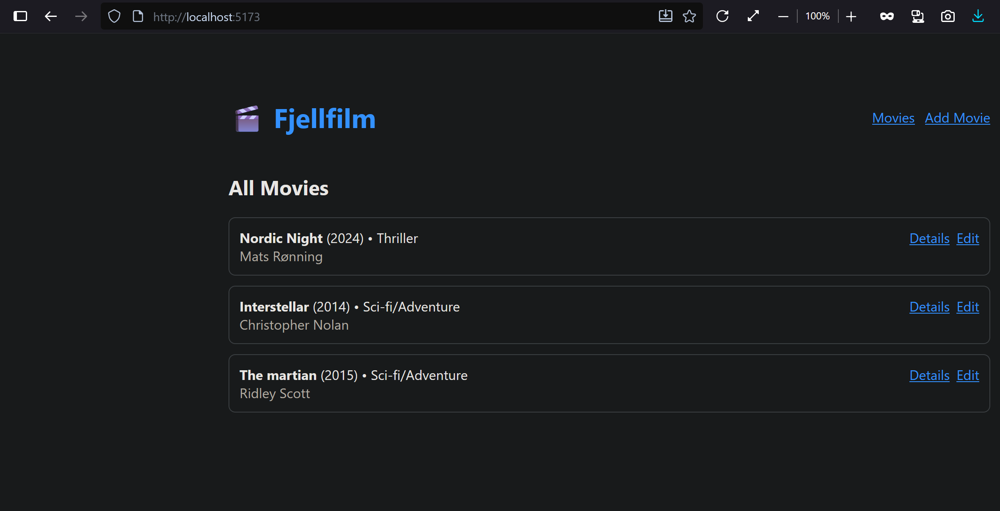
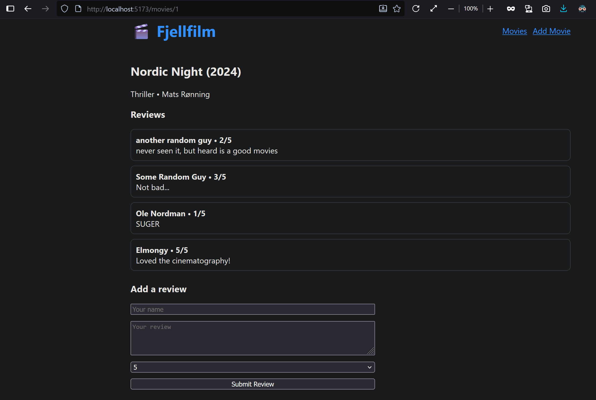
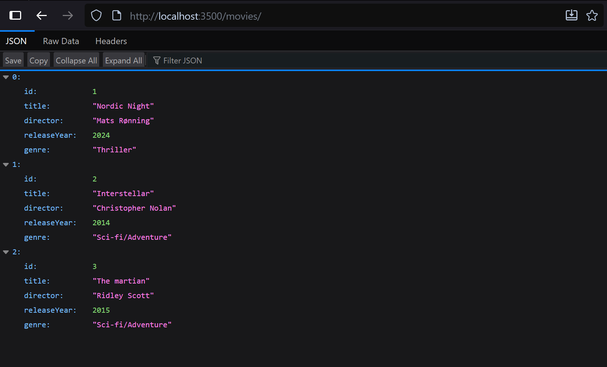

Fjellfilm – Movie Review API (Fullstack)

A tiny full-stack project: Node.js + Express + MS SQL backend with a React (Vite) frontend.
Users can create movies and add reviews (1–5). Designed for easy local setup.

✨ Features

Movies: create, list, get by id, update

Reviews (per movie): create, list

Validation + proper status codes

SQL Server schema with FK + ON DELETE CASCADE

Postman collection included for easy testing

---

🧰 Tech Stack

Backend: Node.js, Express, mssql, dotenv

DB: Microsoft SQL Server

Frontend: React + Vite

Dev tools: Postman/Thunder Client

---

📁 Folder Structure

```pgsql
.
├── client/                 # React app (Vite) Minimal just for testing (mostly vibe coded)
├── server/                 # Express API
│   └── src/
│       ├── app.js
│       ├── main.js
│       ├── DB/
│       │   ├── DB.js
│       │   └── CREATE DATABASE Fjellfilm;.sql
│       ├── routes/
│       │   └── moviesRoutes.js
│       └── controllers/
└── Fjellfilm.postman_collection.json   # (put this in root or /docs)

```

---

## 📸 Screenshots

### FrontEnd HomePage



### FrondEnd MovieDetails



### API /movies Endpoint



### API /movies/:id/reviews Endpoint


---

🚀 Quick Start (TL;DR)

Requirements: Node 18+, SQL Server running locally (Express or Developer edition), VS Code or terminal.

1. Clone & Install

```bash
git clone https://github.com/elm042025/Movie-Review-Fullstack
cd <repo path on ur pc>
cd server && npm install
cd ../client && npm install
```

2. Create the Database

Open server/src/DB/CREATE DATABASE Fjellfilm;.sql in SSMS or VS Code SQL extension.

Run the whole script to create Fjellfilm, Movies, Reviews, constraints, and index.

3. Create a SQL Login (for local dev)
   Run this in SSMS/Azure Data Studio (adjust password if you want):

```sql
USE master;
CREATE LOGIN movie_user WITH PASSWORD = 'movie_user_pwd!';

USE Fjellfilm;
CREATE USER movie_user FOR LOGIN movie_user;
ALTER ROLE db_owner ADD MEMBER movie_user;  -- dev convenience
```

4. Server .env
   Create server/.env:

```ìni

PORT=3500
SQL_SERVER=localhost
SQL_DATABASE=Fjellfilm
SQL_PORT=1433
SQL_USER=movie_user
SQL_PASSWORD=movie_user_pwd!
SQL_ENCRYPT=false
SQL_TRUST_CERT=true

```

Tip: If you use a named instance instead of port 1433, set it in DB.js or your env (and remove SQL_PORT). The current config expects port 1433.

5. Run Backend

```bash
cd server
npm run dev # Server on http://localhost:3500
```

6. Run Frontend

```bash
cd ../client
npm run dev # Vite will show http://localhost:5173
```

You’re live. Open the frontend and/or call the API endpoints below.

---

🔌 API Endpoints

Base URL: http://localhost:3500

Movies

GET /movies → list all movies

GET /movies/:id → get one movie

POST /movies → create movie
Body:

```json
{
  "title": "Inception",
  "director": "Christopher Nolan",
  "releaseYear": 2010,
  "genre": "Sci-Fi"
}
```

PUT /movies/:id → update movie (partial allowed)
Body (send only fields to change):

```json
{
  "title": "Updated Title",
  "releaseYear": 2024
}
```

Reviews (nested)

GET /movies/:id/reviews → list reviews for a movie

POST /movies/:id/reviews → add review
Body:

```json
{
  "reviewAuthor": "Jane Doe",
  "reviewText": "Amazing movie!",
  "rating": 5
}
```

---

Status Codes

200 OK – read/update success

201 Created – movie/review created

204 No Content – (if you add DELETE)

400 Bad Request – invalid input (e.g., missing title or rating)

404 Not Found – movie doesn’t exist

409 Conflict – duplicate (title, releaseYear)

500 Internal Server Error – unexpected server/db error

---

🧪 Testing (Postman/Thunder Client)

Import the included Postman collection:

File: Fjellfilm.postman_collection.json

It includes:

GET /movies

GET /movies/:id

POST /movies

PUT /movies/:id

POST /movies/:id/reviews

GET /movies/:id/reviews

Uses a {{baseUrl}} variable (defaults to http://localhost:3500).

Thunder Client (VS Code) works great too—just mirror the requests.

---

🛡️ CORS (only if you use the separate frontend)

If your frontend runs on http://localhost:5173, ensure the backend allows it:

```js
// server/src/app.js
import cors from "cors";
app.use(cors({ origin: "http://localhost:5173" }));
```

If you served the React build from Express (same origin), you don’t need CORS.

---

🧷 .env Example

Place this in server/.env (don’t commit real secrets):

```ìni
PORT=3500
SQL_SERVER=localhost
SQL_DATABASE=Fjellfilm
SQL_PORT=1433
SQL_USER=movie_user
SQL_PASSWORD=movie_user_pwd!
SQL_ENCRYPT=false
SQL_TRUST_CERT=true
```

---

🐞 Troubleshooting

Connection timeout to SQL Server

Ensure SQL Server service is running.

Enable TCP/IP (SQL Server Configuration Manager).

Use port 1433 or configure your instance accordingly.

Check firewall rules.

Login failed

Re-create login/user and ensure it’s mapped to the Fjellfilm DB:

```sql
USE Fjellfilm;
SELECT name FROM sys.database_principals WHERE type_desc='SQL_USER';
```

Unique constraint violation (2627/2601)

You tried to insert/update a movie with duplicate (title, releaseYear).

---

📜 License

ISC – feel free to use and learn from it.

---

👤 Author

Mohammed S Elmongy

If you run into anything, open an issue or ping me. Happy hacking! 🎬🍿
